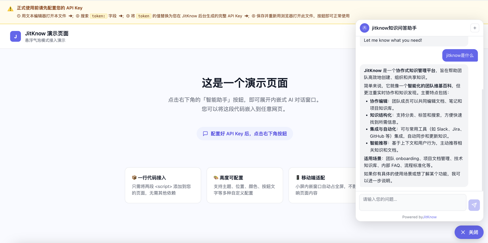

<div align="center">


# JitKnow API オープンプラットフォーム

**🌐 言語 · Language · 语言版本**

[](./JITKNOW_OPENAPI_README.md)
[](./JITKNOW_OPENAPI_README_EN.md)
[](./JITKNOW_OPENAPI_README_JA.md)

**エンタープライズ AI ナレッジベース · 開発者ドキュメント**

[](https://know.jitword.com)
[](https://know.jitword.com)
[](https://know.jitword.com)
[](https://know.jitword.com)
[](https://know.jitword.com)

> 🚀 **5 分でインテグレーション完了** — あなたのウェブサイト・アプリ・社内システムに  
> 専用 AI ナレッジベース Q&A 機能を追加しましょう。  
> 埋め込み Widget · RESTful Chat API · SSE ストリーミング · Citations 出典トレース

[今すぐ始める](https://know.jitword.com/know/login) · [オンラインドキュメント](https://jitword.com) · [技術サポート](https://know.jitword.com)

</div>

---

## 目次

- [✨ 製品概要](#-製品概要)
- [🗺️ 機能マップ](#️-機能マップ)
- [⚡ クイックスタート（5 ステップ）](#-クイックスタート5-ステップ)
- [📦 埋め込み Widget インテグレーション](#-埋め込み-widget-インテグレーション)
  - [フローティングバブル Widget](#フローティングバブル-widget)
  - [iframe 埋め込み](#iframe-埋め込み)
  - [JitMindConfig パラメータ仕様](#jitmindconfig-パラメータ仕様)
- [📡 API リファレンス](#-api-リファレンス)
  - [認証方式](#認証方式)
  - [GET /info · アシスタント情報の取得](#get-info--アシスタント情報の取得)
  - [POST /chat · ストリーミングチャットの開始](#post-chat--ストリーミングチャットの開始-sse)
  - [SSE イベント仕様](#sse-イベント仕様)
- [💻 多言語コードサンプル](#-多言語コードサンプル)
  - [cURL](#curl)
  - [JavaScript](#javascript)
  - [Python](#python)
- [🔐 セキュリティとレート制限](#-セキュリティとレート制限)
- [🚨 エラーコードリファレンス](#-エラーコードリファレンス)
- [❓ よくある質問 FAQ](#-よくある質問-faq)
- [📞 お問い合わせ](#-お問い合わせ)

---

## ✨ 製品概要

JitKnow は**エンタープライズグレードの AI インテリジェントナレッジベースプラットフォーム**です。PDF・Word・Excel・Web ページなど 20 以上のフォーマットのドキュメントを RAG（検索拡張生成）技術で専用 AI ナレッジベースに変換し、精度の高い Q&A を実現します。

**JitKnow オープンプラットフォーム**はこの AI 能力をサードパーティ開発者向けに API として公開します。主なユースケースは以下の通りです：

| シナリオ | 説明 |
|----------|------|
| 🌐 **ウェブサイト AI カスタマーサポート** | 製品マニュアルをベースにした AI アシスタントをウェブサイトに埋め込み、人的サポートを代替 |
| 💼 **社内業務ツール連携** | HR・法務・技術ドキュメントのアシスタントを OA システム・DingTalk・Feishu に統合 |
| 🤖 **アプリ内 AI Q&A** | API 経由でモバイルアプリに AI ナレッジベース Q&A を実装 |
| ⚙️ **SaaS 製品の強化** | 自社 SaaS 製品に AI Q&A モジュールを埋め込み、ユーザー体験を向上 |

---

## 🗺️ 機能マップ

```
┌─────────────────────────────────────────────────────────────┐
│              JitKnow オープンプラットフォーム                  │
├─────────────────┬─────────────────┬─────────────────────────┤
│  📦 埋め込み Widget│  📡 Chat API   │  🔐 セキュリティと管理  │
├─────────────────┼─────────────────┼─────────────────────────┤
│ フローティング    │ GET  /info      │ API Key 権限分離        │
│ バブル Widget   │ POST /chat (SSE)│ IP ホワイトリスト制御   │
│ iframe 埋め込み │ 多ターン会話    │ RPM レート制限          │
│ ダーク/ライト   │ Citations 出典  │ 日次呼び出し上限        │
│ 1行で導入完了   │ リアルタイム配信│ Key 有効期限管理        │
└─────────────────┴─────────────────┴─────────────────────────┘
```

**競合比較：**

| 機能 | JitKnow | Dify | Coze |
|------|:-------:|:----:|:----:|
| API Key 管理（複数 Key + クォータ） | ✅ | ✅ | ✅ |
| SSE ストリーミング出力 | ✅ | ✅ | ✅ |
| 多ターン会話 `conversationId` | ✅ | ✅ | ✅ |
| **Citations 出典トレース** | ✅ **核心差別化** | ✅ | ⚠️ 限定的 |
| IP ホワイトリスト | ✅ | ⚠️ エンタープライズ版のみ | ❌ |
| 埋め込み Widget（embed.js） | ✅ | ✅ | ✅ |
| プライベートデプロイ後の自己ホスト API | ✅ | ✅ | ❌ |
| エンタープライズナレッジベースのネイティブ連携 | ✅ **核心差別化** | ⚠️ 汎用 | ⚠️ 汎用 |

---

## ⚡ クイックスタート（5 ステップ）

### Step 1 · アカウント登録と AI アシスタントの作成

[JitKnow プラットフォーム](https://know.jitword.com/know/login) でアカウントを登録し、AI アシスタントを作成します。製品ドキュメント・FAQ・ナレッジ記事をアップロードして専用ナレッジベースを構築します。

### Step 2 · API Key の取得

**アシスタント詳細 → API インテグレーション タブ → API Key の作成** へ進み、以下を記録します：

- `assistantId`：アシスタントの一意 ID
- API Key：`jk-xxxxxxxxxxxxxxxx` 形式

> ⚠️ **セキュリティ注意**：Key は作成時に一度だけ完全表示されます。安全に保管してください。各 Key はバインドされたアシスタントにのみアクセスできます。

### Step 3 · 接続確認

```bash
# アシスタント情報を取得して Key が有効か確認
curl https://know.jitword.com/open/v1/info \
  -H "Authorization: Bearer jk-xxxxxxxxxxxxxxxx"
```

`200` レスポンスとアシスタント情報が返れば、Key は有効です。

### Step 4 · ストリーミングチャットの開始

```bash
curl -X POST https://know.jitword.com/open/v1/chat \
  -H "Authorization: Bearer jk-xxxxxxxxxxxxxxxx" \
  -H "Content-Type: application/json" \
  -d '{"message":"製品の主要機能を教えてください"}' \
  --no-buffer
```

リアルタイムの SSE ストリーミングレスポンスを受信できます。

### Step 5 · 製品への埋め込み

以下の Widget コードを `</body>` タグの直前に貼り付けます：

```html
<script>
  window.JitMindConfig = {
    assistantId: 'your-assistant-id',
    token:       'jk-xxxxxxxxxxxxxxxx',
    baseUrl:     'https://know.jitword.com',
    btnLabel:    'AIアシスタント',
    btnColor:    '#165DFF'
  }
</script>
<script src="https://know.jitword.com/know/embed.js"></script>
```

**完了！** ページ右下に AI アシスタントのフローティングボタンが表示されます。🎉

---

## 📦 埋め込み Widget インテグレーション

### フローティングバブル Widget

最もシンプルな方法です。`</body>` の直前に以下を貼り付けるだけで、ページに AI アシスタントが追加されます：

```html
<script>
  window.JitMindConfig = {
    assistantId: 'your-assistant-id',   // 必須：AI アシスタント ID
    token:       'jk-xxxxxxxxxxxxxxxx',  // 必須：API Key
    baseUrl:     'https://know.jitword.com', // 任意：プライベートデプロイ時は必須
    btnLabel:    'AIアシスタント',        // 任意：ボタンラベルテキスト
    btnColor:    '#6366F1',              // 任意：ボタンカラー（CSS カラー値）
    theme:       'light',               // 任意：'light' | 'dark'
    position:    'bottom-right',        // 任意：ボタン位置
    width:       380,                   // 任意：パネル幅（px）
    height:      600                    // 任意：パネル高さ（px）
  }
</script>
<script src="https://know.jitword.com/know/embed.js"></script>
```

**表示イメージ：**



### iframe 埋め込み

ページの特定エリアにアシスタントを埋め込む場合に最適です：

```html
<iframe
  src="https://know.jitword.com/know/embed/{assistantId}?key=jk-xxxxxxxxxxxxxxxx&theme=light"
  width="400"
  height="600"
  style="border:none; border-radius:16px; box-shadow:0 4px 24px rgba(0,0,0,0.12)"
  allow="clipboard-write"
></iframe>
```

`{assistantId}` と `jk-xxx` を実際の値に置き換えてください。

> **適したシナリオ**：ヘルプセンターページ、製品詳細ページのインライン Q&A、管理画面など。

### JitMindConfig パラメータ仕様

| パラメータ | 型 | 必須 | デフォルト | 説明 |
|-----------|----|----|-----------|------|
| `assistantId` | `string` | ✅ 必須 | — | AI アシスタントの一意 ID |
| `token` | `string` | ✅ 必須 | — | API Key（`jk-xxx` 形式） |
| `baseUrl` | `string` | 任意 | script origin | API サーバー URL。**プライベートデプロイ時は必須** |
| `theme` | `'light' \| 'dark'` | 任意 | `'light'` | UI テーマ |
| `position` | `'bottom-right' \| 'bottom-left'` | 任意 | `'bottom-right'` | フローティングボタンの位置 |
| `btnColor` | `string` | 任意 | `'#6366F1'` | ボタンカラー（CSS カラー値） |
| `btnLabel` | `string` | 任意 | `'AIアシスタント'` | ボタンラベルテキスト |
| `width` | `number` | 任意 | `380` | パネル幅（px、PC 表示） |
| `height` | `number` | 任意 | `600` | パネル高さ（px、PC 表示） |

---

## 📡 API リファレンス

**Base URL：** `https://know.jitword.com/open/v1`

> プライベートデプロイの場合は `https://know.jitword.com` をお使いのサービスドメインに置き換えてください。

### 認証方式

すべての API リクエストは HTTP ヘッダーに API Key を含める必要があります：

```
Authorization: Bearer jk-xxxxxxxxxxxxxxxx
```

---

### `GET /info` · アシスタント情報の取得

現在の API Key にバインドされたアシスタント情報を取得します。ウェルカムメッセージの初期化やアシスタント名の表示などに使用できます。

**リクエスト例：**

```bash
curl https://know.jitword.com/open/v1/info \
  -H "Authorization: Bearer jk-xxxxxxxxxxxxxxxx"
```

**レスポンス例（200 OK）：**

```json
{
  "id": "asst_abc123",
  "name": "製品ナレッジアシスタント",
  "description": "製品に関する質問に回答します",
  "knowledge_base": "製品ナレッジベース",
  "model": "gpt-4o",
  "welcomeMessage": "こんにちは！製品アシスタントです。何かお手伝いできますか？",
  "suggested_questions": [
    "製品の主要機能は何ですか？",
    "はじめ方を教えてください",
    "対応ファイル形式は何ですか？"
  ]
}
```

**レスポンスフィールド：**

| フィールド | 型 | 説明 |
|-----------|----|----|
| `id` | `string` | アシスタントの一意 ID |
| `name` | `string` | アシスタント名 |
| `description` | `string` | アシスタントの説明 |
| `knowledge_base` | `string` | バインドされたナレッジベース名 |
| `model` | `string` | 使用中の AI モデル |
| `welcomeMessage` | `string` | UI 初期化用ウェルカムメッセージ |
| `suggested_questions` | `string[]` | 推奨質問リスト |

---

### `POST /chat` · ストリーミングチャットの開始（SSE）

AI アシスタントにメッセージを送信し、**SSE ストリーミング形式のレスポンス**を受信します。多ターン会話コンテキストをサポートし、Citations ナレッジ出典参照を返します。

**リクエストヘッダー：**

```
Authorization: Bearer jk-xxxxxxxxxxxxxxxx
Content-Type: application/json
Accept: text/event-stream
```

**リクエストボディ：**

```json
{
  "message": "返金を申請するにはどうすればよいですか？",
  "conversationId": "conv_xxx"
}
```

**リクエストパラメータ：**

| パラメータ | 型 | 必須 | 説明 |
|-----------|----|----|------|
| `message` | `string` | ✅ 必須 | ユーザーメッセージ（最大 8000 文字） |
| `conversationId` | `string` | 任意 | 多ターン会話の続き。省略すると新規会話を開始 |

**レスポンス（SSE ストリーム）：**

```
event: conversation_meta
data: {"conversation_id":"conv_a1b2c3d4"}

event: block_start
data: {}

event: block_delta
data: {"delta":"返金ポリシーに基づき、ご購入後"}

event: block_delta
data: {"delta":"7日以内に返金申請が可能です..."}

event: block_replace
data: {"blocks":[{"type":"text","content":"返金ポリシーに基づき、ご購入後 7 日以内に返金申請が可能です。\n\n申請手順：\n1. アカウントにログイン\n2. 注文詳細へ移動\n3.「返金申請」をクリック","citations":[{"title":"返金ポリシー","source":"利用規約.pdf","page":3,"excerpt":"お客様は購入後7暦日以内に返金申請が可能です..."}]}]}

data: [DONE]
```

---

### SSE イベント仕様

| イベント名 | `data` フィールド | 説明 |
|-----------|----------------|------|
| `conversation_meta` | `{ conversation_id }` | 会話 ID を返します。**保存して**多ターン会話の続きに使用してください |
| `block_start` | — | 新しいコンテンツブロックの開始。ローディングインジケーターの表示に使用 |
| `block_delta` | `{ delta }` | **インクリメンタルストリーミングテキスト** — 表示エリアに追記（タイプライター効果） |
| `block_replace` | `{ blocks[0].content, blocks[0].citations }` | **最終完全コンテンツ**（Citations 含む）— ストリーミング表示を置き換えます |
| `[DONE]` | — | ストリーム終了シグナル — 接続を閉じます |

**処理の推奨方針：**

```
block_delta を監視   → テキストをインクリメンタルに追記（タイプライター効果）
block_replace を監視 → 最終フォーマット済みコンテンツで置き換え（Markdown 処理）
[DONE] を監視       → 接続を閉じ、ローディングを非表示にする
conversation_id を保存 → 次のターンの conversationId パラメータとして使用
```

**Citations フィールド構造：**

```json
"citations": [
  {
    "title": "返金ポリシー",
    "source": "利用規約.pdf",
    "page": 3,
    "excerpt": "お客様は購入後7暦日以内に返金申請が可能です..."
  }
]
```

> 💡 **Citations は JitKnow の核心差別化機能**：すべての回答にナレッジソース（ドキュメント名・ページ番号・原文抜粋）が付与されるため、ユーザーが回答の信頼性を検証でき、信頼度が大幅に向上します。

---

## 💻 多言語コードサンプル

### cURL

```bash
# ── 1. アシスタント情報の取得 ────────────────────────────────
curl https://know.jitword.com/open/v1/info \
  -H "Authorization: Bearer jk-xxxxxxxxxxxxxxxx"

# ── 2. ストリーミングチャットの開始（新規会話） ───────────────
curl -X POST https://know.jitword.com/open/v1/chat \
  -H "Authorization: Bearer jk-xxxxxxxxxxxxxxxx" \
  -H "Content-Type: application/json" \
  -d '{"message":"製品の主要機能を教えてください"}' \
  --no-buffer

# ── 3. 多ターン会話（続き） ──────────────────────────────────
curl -X POST https://know.jitword.com/open/v1/chat \
  -H "Authorization: Bearer jk-xxxxxxxxxxxxxxxx" \
  -H "Content-Type: application/json" \
  -d '{"message":"最初の点について詳しく教えてください","conversationId":"conv_a1b2c3d4"}' \
  --no-buffer
```

---

### JavaScript

```javascript
// JitKnow SSE ストリーミングチャット - JavaScript / TypeScript サンプル

const API_KEY  = 'jk-xxxxxxxxxxxxxxxx'
const BASE_URL = 'https://know.jitword.com/open/v1'

/**
 * AI アシスタントにメッセージを送信し、ストリーミング出力する
 * @param {string} message - ユーザーメッセージ
 * @param {string} [conversationId] - 多ターン会話 ID（任意）
 * @param {function} [onDelta] - インクリメンタルテキスト受信時のコールバック
 * @returns {Promise<string>} 最終完全コンテンツ
 */
async function askAssistant(message, conversationId, onDelta) {
  const response = await fetch(`${BASE_URL}/chat`, {
    method: 'POST',
    headers: {
      'Authorization': `Bearer ${API_KEY}`,
      'Content-Type': 'application/json'
    },
    body: JSON.stringify({ message, conversationId })
  })

  if (!response.ok) {
    const err = await response.json()
    throw new Error(`API エラー ${response.status}: ${err?.error?.message}`)
  }

  const reader      = response.body.getReader()
  const decoder     = new TextDecoder()
  let buffer        = ''
  let currentEvent  = ''
  let finalContent  = ''

  while (true) {
    const { done, value } = await reader.read()
    if (done) break

    buffer += decoder.decode(value, { stream: true })
    const lines = buffer.split('\n')
    buffer = lines.pop() || ''

    for (const line of lines) {
      // イベントタイプ行のパース
      if (line.startsWith('event: ')) {
        currentEvent = line.slice(7).trim()
        continue
      }
      // 空行 = イベント終了
      if (!line.trim()) { currentEvent = ''; continue }
      // data 行以外はスキップ
      if (!line.startsWith('data: ')) continue

      const raw = line.slice(6).trim()
      if (!raw || raw === '[DONE]') continue

      const data = JSON.parse(raw)

      if (currentEvent === 'block_delta' && data.delta) {
        // インクリメンタルストリーミング：UI に追記（タイプライター効果）
        onDelta?.(data.delta)
      }

      if (currentEvent === 'block_replace' && data.blocks?.[0]) {
        // 最終完全コンテンツ（Citations 含む）
        finalContent = data.blocks[0].content
        const citations = data.blocks[0].citations || []
        console.log('出典:', citations)
      }
    }
  }

  return finalContent
}

// ── 使用例 ──────────────────────────────────────────────────

const outputEl = document.getElementById('output')

askAssistant(
  '製品の主要機能を教えてください',
  undefined,              // 新規会話 — conversationId なし
  (delta) => {            // インクリメンタルテキストを追記
    outputEl.textContent += delta
  }
).then(finalContent => {
  // ストリーミング表示を最終フォーマット済みコンテンツで置き換え
  outputEl.innerHTML = markdownToHtml(finalContent) // Markdown レンダラーを使用
})
```

---

### Python

```python
# JitKnow SSE ストリーミングチャット - Python サンプル
# 依存関係：pip install requests

import requests
import json

API_KEY  = "jk-xxxxxxxxxxxxxxxx"
BASE_URL = "https://know.jitword.com/open/v1"
HEADERS  = {"Authorization": f"Bearer {API_KEY}"}


def get_info() -> dict:
    """アシスタント情報を取得する"""
    resp = requests.get(f"{BASE_URL}/info", headers=HEADERS)
    resp.raise_for_status()
    return resp.json()


def chat_stream(message: str, conversation_id: str = None) -> str:
    """
    SSE ストリーミングチャットを送信する

    :param message: ユーザーメッセージ
    :param conversation_id: 多ターン会話 ID（任意）
    :return: 最終完全な回答内容
    """
    body = {"message": message}
    if conversation_id:
        body["conversationId"] = conversation_id

    final_content = ""
    current_event = ""

    with requests.post(
        f"{BASE_URL}/chat",
        headers={**HEADERS, "Content-Type": "application/json"},
        json=body,
        stream=True
    ) as resp:
        resp.raise_for_status()

        for line in resp.iter_lines(decode_unicode=True):
            if line.startswith("event: "):
                current_event = line[7:].strip()

            elif line.startswith("data: "):
                raw = line[6:].strip()
                if not raw or raw == "[DONE]":
                    continue

                data = json.loads(raw)

                if current_event == "block_delta" and "delta" in data:
                    # インクリメンタルテキストをリアルタイム出力（タイプライター効果）
                    print(data["delta"], end="", flush=True)

                elif current_event == "block_replace" and "blocks" in data:
                    # 最終完全コンテンツを取得
                    block = data["blocks"][0]
                    final_content = block.get("content", "")
                    citations = block.get("citations", [])
                    if citations:
                        print("\n\n📚 出典：")
                        for c in citations:
                            print(f"  - {c['title']} ({c['source']}, p.{c.get('page', '-')})")

            elif not line:
                current_event = ""

    print()  # 改行
    return final_content


# ── 使用例 ──────────────────────────────────────────────────

if __name__ == "__main__":
    # アシスタント情報の取得
    info = get_info()
    print(f"アシスタント名：{info['name']}")
    print(f"ウェルカムメッセージ：{info['welcomeMessage']}\n")

    # 1 ターン目の会話
    print("ユーザー：製品の主要機能を教えてください\nAI：", end="")
    chat_stream("製品の主要機能を教えてください")

    # 多ターン会話（conversation_meta イベントから conversation_id を保存）
    # conv_id = "conv_a1b2c3d4"
    # chat_stream("最初の点について詳しく教えてください", conversation_id=conv_id)
```

---

## 🔐 セキュリティとレート制限

JitKnow オープン API は**3 層セキュリティモデル**を採用し、サービスの安全性と安定性を確保します。

### 第 1 層：API Key 権限分離

- 各 API Key は**作成時にバインドした単一のアシスタントにのみアクセス可能**。クロスアシスタントアクセスは不可
- 漏洩した Key はコンソールから**即時無効化または削除**が可能。他の Key への影響なし
- Key にプラットフォームユーザー ID は含まれません。呼び出し元のユーザー管理は開発者が自身で行います

**Key のライフサイクル：**

```
Key 作成 → [有効] → 無効化 → [無効] → 再有効化
                 ↓
               削除（元に戻せません）
```

### 第 2 層：IP ホワイトリスト（任意）

Key に対して許可するアクセス元 IP アドレスを設定します。ホワイトリスト外の IP からのリクエストは `HTTP 403` で拒否されます。

- 個別 IP 指定：`192.168.1.100`
- CIDR 範囲指定：`10.0.0.0/8`
- Key あたり最大 20 件のルール
- 空欄にすると IP 制限なし（フロントエンドから直接呼び出す場合に適切）

> 💡 **ベストプラクティス**：サーバーサイド呼び出しには IP ホワイトリストを設定し、フロントエンド直接呼び出しには日次クォータと組み合わせてください。

### 第 3 層：呼び出し頻度制御

| クォータ種別 | 対象スコープ | 超過時のレスポンス | リセットタイミング |
|------------|------------|----------------|---------------|
| **RPM レート制限** | 分間リクエスト数 | `HTTP 429` | スライディングウィンドウ、リアルタイム |
| **日次呼び出しクォータ** | 1 日あたり最大呼び出し数 | `HTTP 429` | 毎日 00:00（UTC+8）自動リセット |
| **Key 有効期限** | 有効期限の日付 | `HTTP 401` | コンソールで手動延長 |

### 呼び出しログと監査

すべての API 呼び出しは詳細なログとして記録されます：

| ログフィールド | 説明 |
|------------|------|
| リクエスト時刻 | ミリ秒精度 |
| 送信元 IP | 呼び出し元の IP アドレス |
| Key 名称 | 呼び出し元システムの識別 |
| レイテンシ | 初回バイト時間 + 総所要時間 |
| Token 使用量 | prompt / completion / total |
| ステータス | 成功 / 失敗（エラーコード含む） |

---

## 🚨 エラーコードリファレンス

すべてのエラーレスポンスは以下の統一フォーマットに従います：

```json
{
  "error": {
    "code": "rate_limit_exceeded",
    "message": "API Key の分間呼び出し制限（20 回/分）を超過しました。30 秒後に再試行してください。",
    "retry_after": 30
  }
}
```

**完全なエラーコード一覧：**

| HTTP ステータス | `error.code` | 説明 | 推奨対処 |
|:-------------:|--------------|------|---------|
| `401` | `invalid_api_key` | API Key が無効または削除済み | Key の値を確認してください |
| `401` | `api_key_expired` | API Key の有効期限が切れている | コンソールで再有効化または新規 Key を作成 |
| `403` | `ip_not_allowed` | リクエスト IP がホワイトリスト外 | サーバーの送信元 IP 設定を確認 |
| `403` | `assistant_disabled` | アシスタントが無効化されている | コンソールでアシスタントを再有効化 |
| `422` | `query_too_long` | 入力が 8000 文字の上限を超過 | 入力を短縮してください |
| `429` | `rate_limit_exceeded` | RPM レート制限に到達 | `retry_after` 秒後に再試行 |
| `429` | `daily_quota_exceeded` | 日次呼び出しクォータを消費 | 毎日 00:00 UTC+8 の自動リセットを待機 |
| `500` | `model_error` | 基盤 AI モデルの呼び出し失敗 | しばらく後に再試行するか技術サポートに連絡 |
| `503` | `service_unavailable` | サービス一時的に利用不可 | サービス回復を待ち、バックオフリトライを実装 |

**推奨エラーハンドリング実装：**

```javascript
async function callWithRetry(fn, maxRetries = 3) {
  for (let attempt = 0; attempt < maxRetries; attempt++) {
    try {
      return await fn()
    } catch (err) {
      if (err.status === 429) {
        const retryAfter = err.retryAfter || 30
        await sleep(retryAfter * 1000)
        continue
      }
      if (err.status === 503 && attempt < maxRetries - 1) {
        await sleep(2 ** attempt * 1000) // 指数バックオフ
        continue
      }
      throw err
    }
  }
}
```

---

## ❓ よくある質問 FAQ

<details>
<summary><strong>Q：API Key が漏洩した場合はどうすればよいですか？</strong></summary>

**すぐに** JitKnow コンソール → アシスタント詳細 → API インテグレーション タブ → 対象の Key を見つけ → **「無効化」または「削除」**をクリックしてください。

無効化後、その Key を使用したすべてのリクエストは `401` を返します。他の Key やアシスタントには影響ありません。新しい Key を作成してサービス設定を更新することをお勧めします。

</details>

<details>
<summary><strong>Q：プライベートデプロイ後に API を自己ホストできますか？</strong></summary>

完全に対応しています。自己ホストの JitKnow インスタンスは SaaS バージョンと同等の機能を持ち、オープン API も同様に動作します。

すべての API 呼び出し URL をプライベートサービスドメインに変更するだけです：
- Widget：`baseUrl: 'https://your-domain.com'` を設定
- API 直接呼び出し：`https://know.jitword.com` を `https://your-domain.com` に置き換え

</details>

<details>
<summary><strong>Q：/chat はストリーミングのみですか？完全なレスポンスを取得するには？</strong></summary>

`/chat` エンドポイントは最良のユーザー体験のため SSE ストリーミングを使用しています。

バッチ処理やサーバーサイド生成など、完全なレスポンスを待機するシナリオでは、**`block_replace`** イベントを監視してください：

```javascript
if (currentEvent === 'block_replace') {
  const finalContent = data.blocks[0].content  // 最終完全コンテンツ
  const citations    = data.blocks[0].citations // Citations 出典
  // 接続を閉じ、完全なコンテンツを処理
}
```

</details>

<details>
<summary><strong>Q：Citations 出典トレースはどのように機能しますか？</strong></summary>

JitKnow は **RAG（検索拡張生成）技術**を使用しています。すべての回答で、ナレッジベースから関連するドキュメントチャンクを検索して参照根拠として使用します。

`block_replace` イベントの `blocks[0].citations` 配列には以下が含まれます：
- `title`：参照ドキュメント名
- `source`：元のファイル名
- `page`：ページ番号
- `excerpt`：原文の抜粋

UI に折りたたみ可能な「出典」パネルを表示することをお勧めします。AI 回答に対するユーザーの信頼度が大幅に向上します。

</details>

<details>
<summary><strong>Q：基盤 AI モデル（GPT-4o / Claude / Deepseek）はどう変更しますか？</strong></summary>

モデルは JitKnow コンソールの「**アシスタント設定**」で設定します。対応モデル：
- GPT-4o、GPT-4 Turbo
- Claude 3.5 Sonnet、Claude 3 Opus
- Gemini Pro
- Deepseek V3
- カスタム OpenAI プロトコル互換モデル

アシスタント設定でモデルを変更すると、API 呼び出しは**自動的に新しいモデルを使用**します。コード変更は不要です。

</details>

<details>
<summary><strong>Q：クォータを超過した場合はどうなりますか？どう対処すればよいですか？</strong></summary>

RPM 制限または日次クォータを超過すると、`HTTP 429 Too Many Requests` が返ります：

```json
{
  "error": {
    "code": "rate_limit_exceeded",
    "message": "リクエスト頻度が制限を超えました。しばらくしてから再試行してください",
    "retry_after": 30
  }
}
```

**推奨対処方針：**
- フロントエンド：「サービスが混雑しています。しばらくしてから再試行してください」とフレンドリーなメッセージを表示
- バックエンド：指数バックオフリトライを実装し、`retry_after` 秒待機後に再試行
- 日次クォータ：毎日 00:00 UTC+8 に自動リセット

</details>

<details>
<summary><strong>Q：多ターン会話はどのように機能しますか？conversationId はどこから取得しますか？</strong></summary>

多ターン会話のキーは `conversationId` です：

**1 ターン目**（新規会話）：`conversationId` を渡さないでください。最初の SSE イベント `conversation_meta` に含まれます：

```
event: conversation_meta
data: {"conversation_id":"conv_a1b2c3d4"}
```

**以降のターン**：リクエストボディに `conversationId: "conv_a1b2c3d4"` を渡すことでコンテキストを継続できます。

> API バックエンドは最近 10 ターンの会話履歴を保持します（アシスタント設定で変更可能）。

</details>

---

## 📞 お問い合わせ

| チャンネル | 連絡先 |
|-----------|-------|
| 📧 メール | flowmix@163.com |
| 💬 WeChat | cxzk_168 |
| 🌐 ウェブサイト | [know.jitword.com](https://know.jitword.com) |
| 🏢 会社名 | 重慶橙訊智科科技有限公司 |

> インテグレーションでお困りの場合は、WeChat **cxzk_168** を追加して 1 対 1 の技術サポートを受けてください。

---

<div align="center">

**[今すぐ登録して API Key を取得 →](https://know.jitword.com/know/login)**

© 2026 JitKnow

*1 行のコードで、あなたのプロダクトに AI ナレッジを。*

</div>
